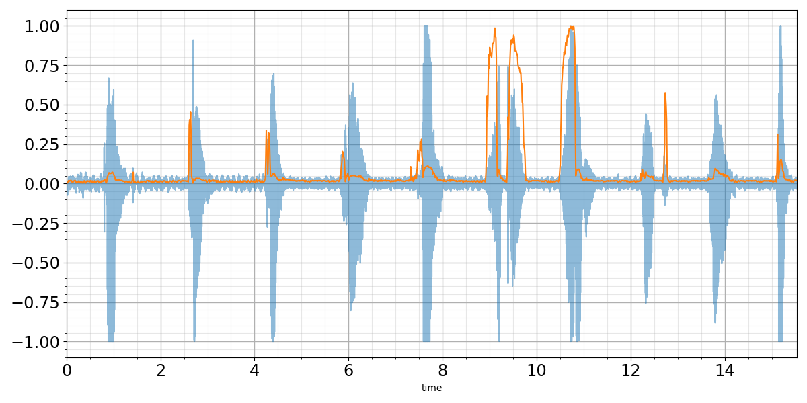
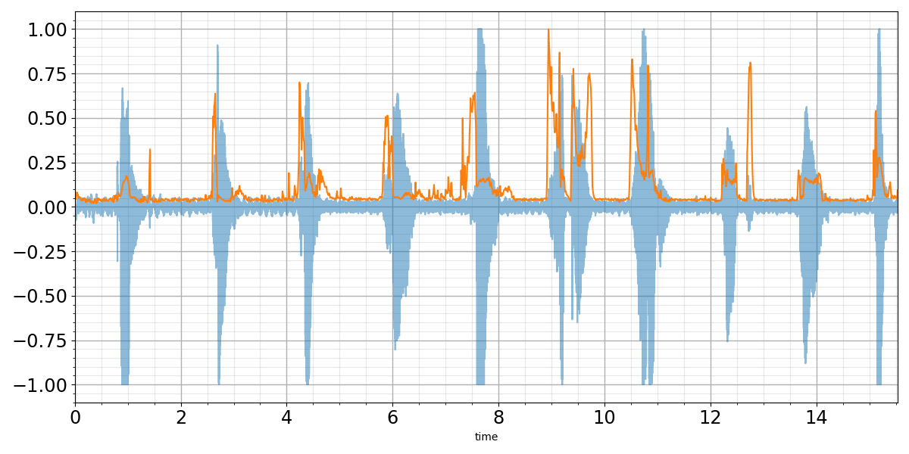
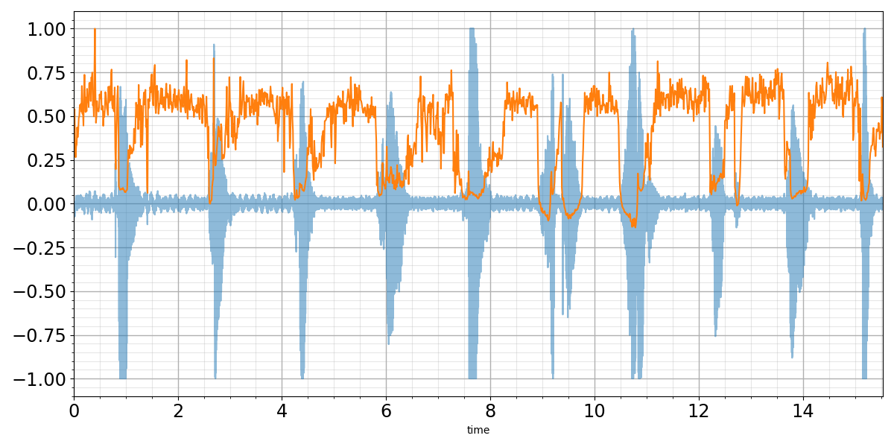
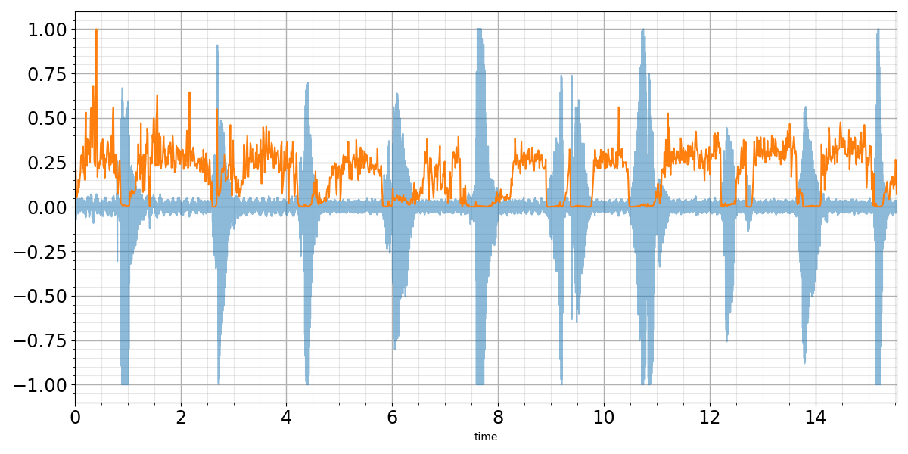
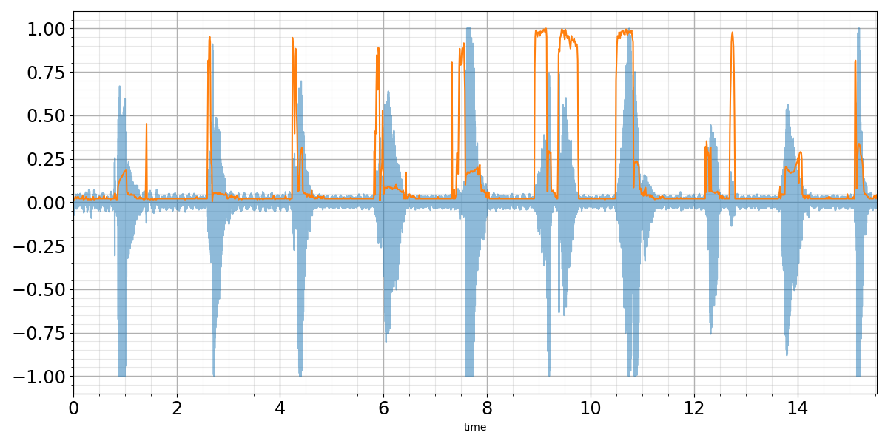
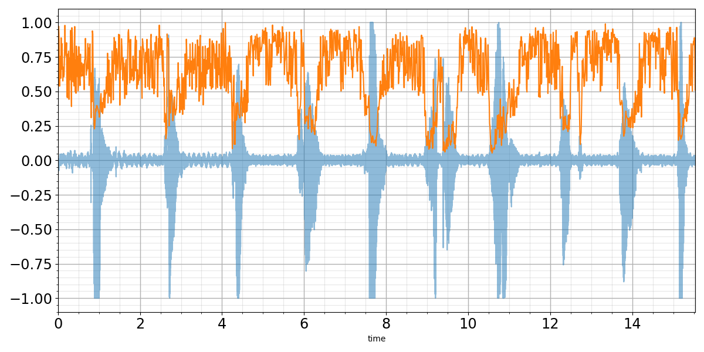
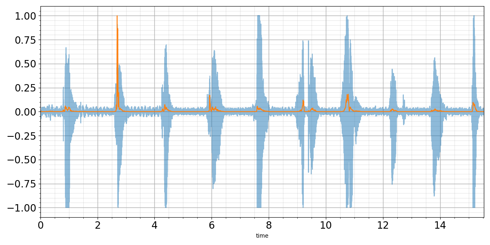
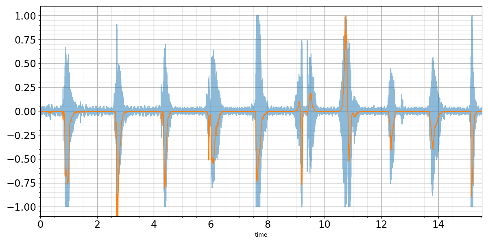
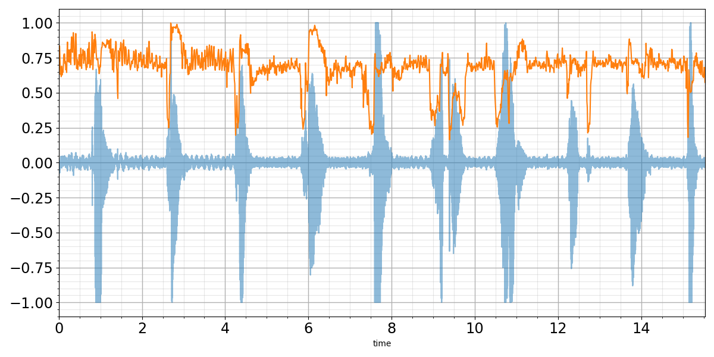
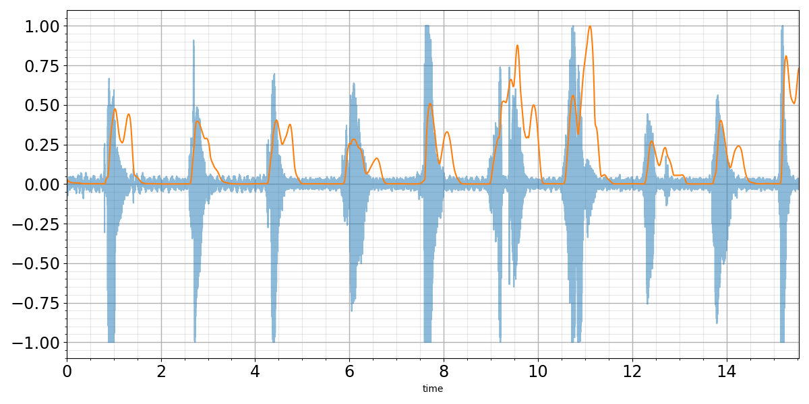

# Spectral Features

Spectral features are widely used in machine and deep learning research. The code shows implementations of basic features for voice/speech analysis.

- [`SpectralEntropy`](https://www.mathworks.com/help/audio/ref/spectralentropy.html)
- [`SpectralCentroid`](https://www.mathworks.com/help/audio/ref/spectralcentroid.html)
- [`SpectralSpread`](https://www.mathworks.com/help/audio/ref/spectralspread.html)
- [`SpectralSkewness`](https://www.mathworks.com/help/audio/ref/spectralskewness.html)
- [`SpectralKurtosis`](https://www.mathworks.com/help/audio/ref/spectralkurtosis.html)
- [`SpectralRolloffPoint`](https://www.mathworks.com/help/audio/ref/spectralrolloffpoint.html)
- [`SpectralCrest`](https://www.mathworks.com/help/audio/ref/spectralcrest.html)
- (WIP) [`SpectralFlux`](https://www.mathworks.com/help/audio/ref/spectralflux.html)
- [`SpectralSlope`](https://www.mathworks.com/help/audio/ref/spectralslope.html)
- [`SpectralFlatness`](https://www.mathworks.com/help/audio/ref/spectralflatness.html)
- (WIP) Ma, Y., Nishihara, A. Efficient voice activity detection algorithm using [`long-term spectral flatness`](https://www.researchgate.net/publication/257879209_Efficient_voice_activity_detection_algorithm_using_long-term_spectral_flatness_measure) measure. J AUDIO SPEECH MUSIC PROC. 2013, 87 (2013).

# References

The code highly refers to the [`Matlab`](https://www.mathworks.com/help/audio/ug/spectral-descriptors.html) tutorial, and uses `Pytorch` and some functions of [`Speechbrain`](https://github.com/speechbrain/speechbrain) to achieve.

# Prepare an Environment

```
git clone https://github.com/BrownsugarZeer/SpectralFeatures.git
python -m venv venv
venv\Scripts\activate.bat
pip install -r requirements.txt
```

# Running an Experiment

My file path of waveform is `<path_to_matlab>\MATLAB\R2019b\toolbox\audio\samples\Counting-16-44p1-mono-15secs.wav` and has been downsampled from 44100 Hz to 16000 Hz.

- Spectral Entropy

```python
x, fs = torchaudio.load("Counting-16-44p1-mono-15secs_16000.wav")
compute_feat = SpectralEntropy(sample_rate=fs)
spectr_feat = compute_feat(x)
plot_feature(x, fs, spectr_feat)
```


---

- Spectral Centroid

```python
x, fs = torchaudio.load("Counting-16-44p1-mono-15secs_16000.wav")
compute_feat = SpectralCentroid(sample_rate=fs)
spectr_feat = compute_feat(x)
plot_feature(x, fs, spectr_feat)
```



---

- Spectral Spread

```python
x, fs = torchaudio.load("Counting-16-44p1-mono-15secs_16000.wav")
compute_feat = SpectralSpread(sample_rate=fs)
spectr_feat = compute_feat(x)
plot_feature(x, fs, spectr_feat)
```



---

- Spectral Skewness

```python
x, fs = torchaudio.load("Counting-16-44p1-mono-15secs_16000.wav")
compute_feat = SpectralSkewness(sample_rate=fs)
spectr_feat = compute_feat(x)
plot_feature(x, fs, spectr_feat)
```



---

- Spectral Kurtosis

```python
x, fs = torchaudio.load("Counting-16-44p1-mono-15secs_16000.wav")
compute_feat = SpectralKurtosis(sample_rate=fs)
spectr_feat = compute_feat(x)
plot_feature(x, fs, spectr_feat)
```



---

- Spectral Rolloff Point

```python
x, fs = torchaudio.load("Counting-16-44p1-mono-15secs_16000.wav")
compute_feat = SpectralRolloffPoint(sample_rate=fs)
spectr_feat = compute_feat(x)
plot_feature(x, fs, spectr_feat)
```



---

- Spectral Crest

```python
x, fs = torchaudio.load("Counting-16-44p1-mono-15secs_16000.wav")
compute_feat = SpectralCrest(sample_rate=fs)
spectr_feat = compute_feat(x)
plot_feature(x, fs, spectr_feat)
```



---

- Spectral Flux

```python
x, fs = torchaudio.load("Counting-16-44p1-mono-15secs_16000.wav")
compute_feat = SpectralFlux(sample_rate=fs)
spectr_feat = compute_feat(x)
plot_feature(x, fs, spectr_feat)
```



---

- Spectral Slope

```python
x, fs = torchaudio.load("Counting-16-44p1-mono-15secs_16000.wav")
compute_feat = SpectralSlope(sample_rate=fs)
spectr_feat = compute_feat(x)
plot_feature(x, fs, spectr_feat)
```



---

- Spectral Flatness

```python
x, fs = torchaudio.load("Counting-16-44p1-mono-15secs_16000.wav")
compute_feat = SpectralFlatness(sample_rate=fs)
spectr_feat = compute_feat(x)
plot_feature(x, fs, spectr_feat)
```



---

- Long-Term Spectral Flatness

```python
x, fs = torchaudio.load("Counting-16-44p1-mono-15secs_16000.wav")
compute_feat = LongTermSpectralFlatness(sample_rate=fs)
spectr_feat = compute_feat(x)
plot_feature(x, fs, spectr_feat)
```



# Issue

The readability of the code will sometimes leads to lower performance..
